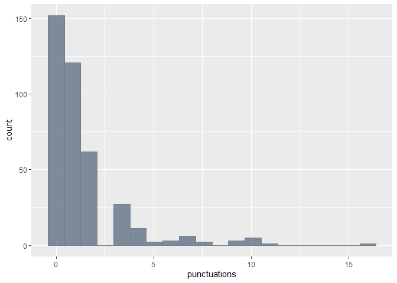
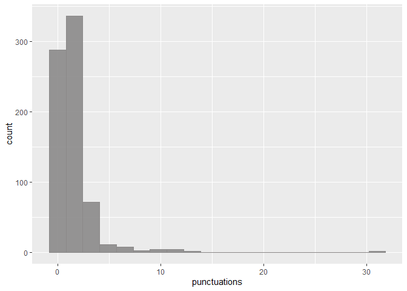
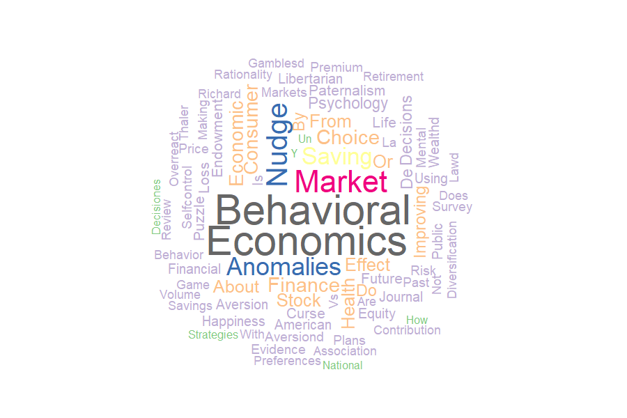
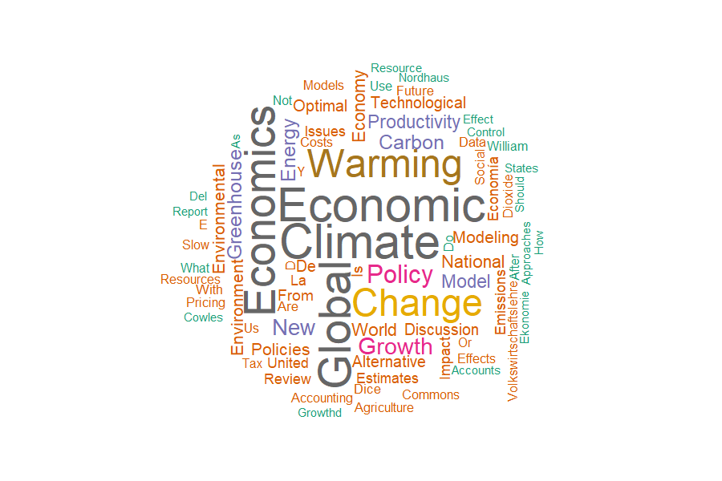
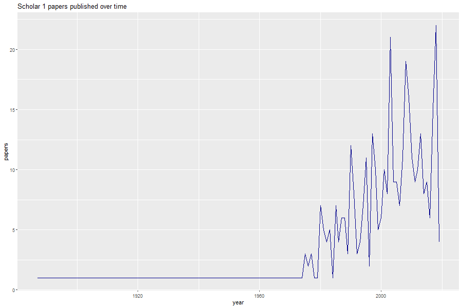
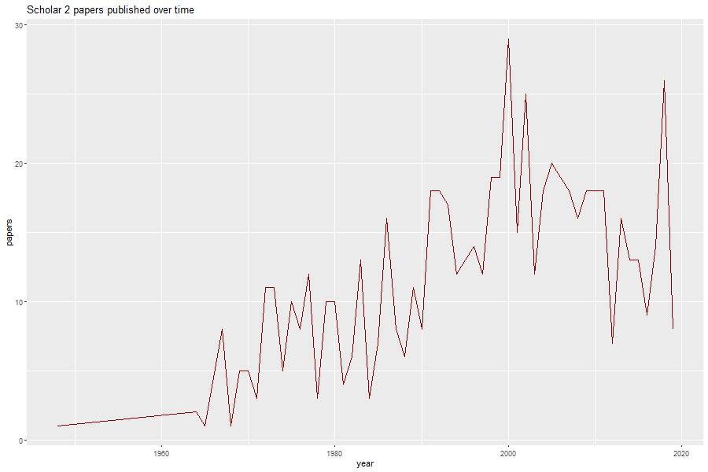
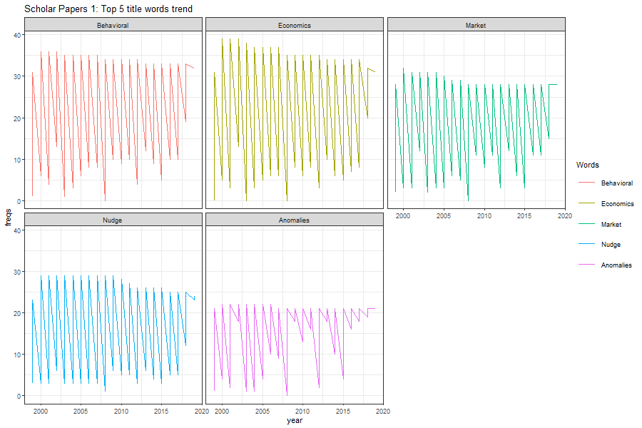
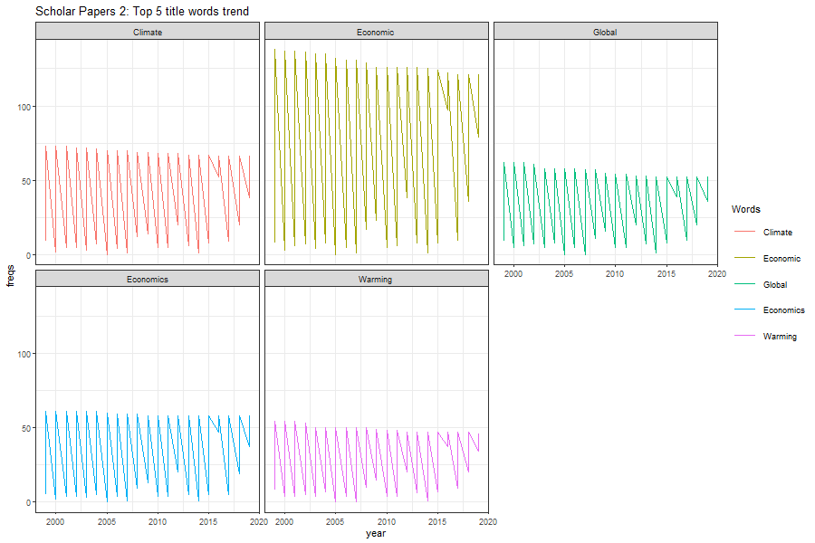

Workout03 - Google Scholar Citations dataset Analysis
================
Najiyullah Sanee
12/5/2019

This data analysis is conducted on two datasets obtained from google
scholar.

Dataset 1: Richard Thaler Dataset 2: William Nordhaus

  
Raw data was obtained from google scholar citations, and after cleaning
up as necessary I will be conducting some analysis on the clean
datasets.

We will start out with basic analysis on the first information in the
datasets, paperTitles.

  

#### **Titles for Scholar 1 Papers**

-----

In the set of all paper titles for scholar 1, the count of names
beginning with a vowel is:

    ## [1] 116

  

And the count of all titles ending with an “s” is:

    ## [1] 92

  

The Longest title from the data of Scholar 1 papers is :

    ## [1] "Agarwal, S., Liu, C. and Souleles, NS (2007)â\200\230The reaction of consumer spending and debt to tax rebates-evidence from consumer credit dataâ\200\231, Journal of Political Economy, 115 â\200¦"

  

For the entire dataset of Scholar 1, the following is the summary
statistics of punctuations found in paper titles:

    ##    Min. 1st Qu.  Median    Mean 3rd Qu.    Max. 
    ##   0.000   0.000   1.000   1.414   2.000  16.000

  

Lets visualize these statisctis in the form of a histogram

  

<!-- -->

  

*Next, I will do the same basic analysis with the Scholar 2 dataset*.

  

#### **Titles for Scholar 2 Papers**

-----

For Scholar 2 papers, the count of titles beginning with a vowel is:

    ## [1] 242

  

The count of titles ending with the letter “s” is:

    ## [1] 132

  

The Longest title from data of Scholar 2 papers is:

    ## [1] "Justin Mellor,\" The Negative Effects of Chemobyl on International Environ-mental Law: The Creation of the Polluter Gets Paid Principle,\" 17 Wis. Int'l LJ 65 (1999). A. Midhun …"

  

For the entire dataset of Scholar 2, the following is the summary
statistics of punctuations found in paper titles

    ##    Min. 1st Qu.  Median    Mean 3rd Qu.    Max. 
    ##   0.000   0.000   1.000   1.279   2.000  31.000

  

And we can visualize these statistics with a histogram as well:

  

<!-- -->

  

This should suffice for basic analysis of paper titles. Now moving on to
more interesting information about the titles. We can start by analysing
meaningful words appearing in the names of all papers. And to do ths, we
will need to exclude irrelevant parts such as punctuations and stop
words.

  

  

After applying some cleanup codes, both datasets paperTitles now only
contain meaningful words. Starting with Scholar 1 papers, we can now
count the frequency of distinct words that appeared in titles.

  

#### The top 10 results from this analysis are as follows :

-----

    ##         Words Freq
    ## 1  Behavioral   40
    ## 2   Economics   39
    ## 3      Market   27
    ## 4       Nudge   25
    ## 5   Anomalies   21
    ## 6      Saving   19
    ## 7      Choice   15
    ## 8     Finance   15
    ## 9    Consumer   14
    ## 10   Economic   14

  

The top two words are interestingly the name of Richard Thaler’s
(Scholar 1 ) area of expertise in economics, as well as ‘Nudge’ which
his work popularized. The remainder are also words of frequent use in
behavioral economics research as well.

  

#### Then for Scholar 2, the following are the top 10 words appearing in titles:

-----

    ##         Words Freq
    ## 1     Climate   78
    ## 2    Economic   77
    ## 3      Global   72
    ## 4   Economics   69
    ## 5     Warming   60
    ## 6      Change   58
    ## 7      Policy   35
    ## 8      Growth   30
    ## 9         New   28
    ## 10 Greenhouse   24

  

The frequency of words is noticeably higher for scholar 2 papers, which
is expected given the dataset has a much higher quantity of published
papers.

  

As with scholar 1 titles, this also is consistent with William Nordhaus’
(Scholar 2) area of expertise in Environmental Economics. Other top
appearing words are also very clearly related to environmental policy,
research and discussions. The analysis on meaningful and most frequent
words unsurprisingly shows both scholars papers have an emphasis on
their respective areas of expertise.

  

Now I can use these results to perform some visual analysis as well.

  

  

Using the frequency data generated for words appearing in titles, I can
create a wordcloud which gives a visual representation of the data.

  

-----

#### **This is a word cloud for the words frequency data from Scholar 1 papers :**

  

**The wordcloud uses a sizeable sample of a words frequency table I
generated. Words are randomly placed, however their sizes will vary by
their frequency in the table.**

*And from the wordcloud representation, we can clearly see that the
largest words are most likely the most frequent. And this is true from
the table seen previously, but its always nice to see cool visuals.*

  

Now we can do the same visual analysis for the second dataset as well.

  

-----

#### **This is a wordcloud of meaningful words appearing in Scholar 2 paper titles:**

  

*The results here also follow what we saw in the table previously.*

  

Aside from the words appearing in titles, we might also be interested in
visualizing a timeline of papers published by each scholar over the
years.

  

Starting with Scholar 1, the following plot shows the trend of papers
published from the earliest appearing year.

  

-----

  

The plot has a timeline beginning as early as around 1880, perhaps
counting a paper/research attributed to Thaler that used some older
published work as reference.

  

The trend is however more consistent fromyears around 1980 up till 2010.
The plot shows the highest number of papers published are between 2000
to around 2010. And the trend sharply fell from around 2010 up to recent
years.

  

**I will now move on to explore the visual trend of Scholar 2 papers.**

  

-----

  

The trend of papers published by Scholar 2 are more varying over time.
The timeline begins at around 1950 with grwoth increasing beginning at
some years before 1970. The trend then grew steadily and with a
consistend variation reaching the highest point at the year 2000. The
plot shows the highest amount of papers published were between the years
1990 and 2015. This is similar to the peak observations for Scholar 1,
and in this case also, the trend has sharply fallen since 2015.

  

-----

  
  

Returning back to the most frequent words in paper titles, It would be
interesting to see how their trend was over time as well.

  

#### **Trend for Scholar 1 title words**

-----

  

The trend of the top 5 words are all following a consistent pattern over
the years. The size of the trend for ‘Economics’ and ‘Behavioral’ is
noticeably larger given that they are the top 2 frequent words in
titles. The pattern shows the peak frequency of each words was around
throughout the range of years from 2000 - 2020.

  

#### **Trend for Scholar 2 title words**

-----

  

In the second scholar dataset titles, the trend also follows a very
similar pattern as from the first. The word ‘Economic’ has the largest
trend with the highest peaks of frequency. The remaining 4 words each
had about the same peaks of frequency througout the period from 2000 -
2020.

  

-----

  

**Since we have done some useful analysis with paper titles and years,
next we can analyse other information in the dataset.**

  

  

Lets take a look at the information about authors, or rather co-authors
for both scholars.

  

After analysing through the data and creating a list of co-authors, I
can get some insight about the average number of co-authors on a paper
for each scholar.  

For Richard Thaler, the average number of co-athours for the 396 papers
published are:

    ## [1] 1.603535

For William Nordhaus, the average number of co-authors for 725 papers
published are:

    ## [1] 1.382069

  

***From the results, I can note that Richard Thaler had a higher number
of co-auhtors on average.***

-----

  

Given both scholars are experts in Economics, it is very possible that
they have some common co-authors. After comparing the information of
individual co-auhtors from both scholar’s dataset, we have the following
list of mutual co-authors:

-----

    ##  [1] "M Adler"     "Kj Arrow"    "S Folland"   "Ac Goodman"  "M Stano"    
    ##  [6] "R Aaberge"   "Hj Aaron"    "Ta Abbott"   "Jm Legge"    "Es Andersen"
    ## [11] "N Ascherson" "Ps Atiyah"   "R Axelrod"   "E Duflo"     "M Bhuller"  
    ## [16] "A Langorgen" "M Mogstad"   "Ab Abel"     "N Gregory"   "P Aalto"    
    ## [21] "H Aaron"     "S Abbasi"    "N Abbasi"    "Am Abbot"    "J Achenbach"
    ## [26] "B Ackerman"  "Ng Mankiw"   "R Feldman"

  

**The analysis can also find any possible common papers between both
scholars. However, the two scholars do not have any papers in common
with one another in either dataset.**

  
  

The last information we can analyse in both datasets is journal names
and citations. We can do some analysis using both, but first it would be
nice to have a distinct list of journal names.

  

After analysing the data from both scholars, we can obtain the total
number of distinct journals combining both mutual and differing in the
two datasets. The total number is as follows :

    ## [1] 200

-----

  

#### Now we can use the list of distinct journals compiled to get meaningful information about citations.

  

The list of journal names is compared through both scholar datasets and
citation counts observed are tallied, giving the following tabular
result:

  

    ##                                      journals citations
    ## 1            Constitutional Political Economy     28777
    ## 2            Journal Of Economic Perspectives     23206
    ## 3                      The Journal Of Finance     17944
    ## 4                           Marketing Science      6985
    ## 5  Journal Of Economic Behavior  Organization      6711
    ## 6          The Quarterly Journal Of Economics      6218
    ## 7        National Bureau Of Economic Research      4332
    ## 8        Handbook Of The Economics Of Finance      4100
    ## 9                       Yale University Press      3727
    ## 10                        Stanford Law Review      3669

This is the top 10 journals with highest combined citations from both
scholar datasets.

  

From the table result, we can see the most highly cited journals are :

> Consitutional Political Economy  
> Journal of Economic Perspectives  
> The Journal of Finance  

However, the journal ‘Constitutional Political Economy’ is the most
influential according to both datasets with a recorded citations at
**28777**.

  

This concludes my analysis of the scholar citations datasets of Richard
Thaler and William Nordhaus.

-----
