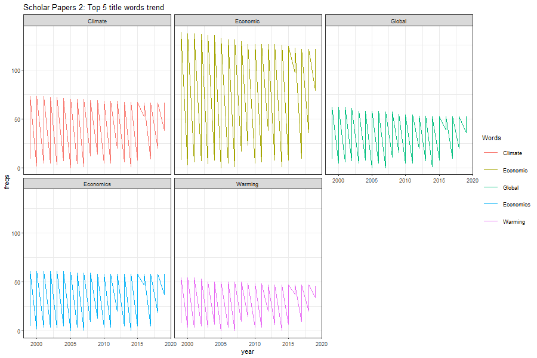

```{r setup, include=FALSE}
knitr::opts_chunk$set(echo = FALSE)
```


```{r message=FALSE}

library(readr)
library(ggplot2)
library(dplyr)
library(stringr)
library(wordcloud)
library(reshape2)

```

```{r}

#loading clean csv datasets for both scholars
data1 <- read.csv(file = '../data/cleandata/scholar1_dataset.csv', header = TRUE, sep = ",", na.strings = c("", "NA"), stringsAsFactors = FALSE)
data2 <- read.csv(file = "../data/cleandata/scholar2_dataset.csv", header = TRUE, sep = ",", na.strings = c("", "NA"), stringsAsFactors = FALSE)
```


```{r}
# Remove rows with non-english Paper titles.
data1<- data1 %>%
  filter(!str_detect(data1$paperName, "<U+"))

data2 <- data2 %>%
  filter(!str_detect(data2$paperName, "<U+"))
```

 This data analysis is conducted on two datasets obtained from google scholar.

 Dataset 1: Is for Behavioral Economist Richard Thaler,  who was awarded the Nobel memorial prize in Economic sciences in 2017.
 Dataset 2: Is for Environmental Economist, William Nordhaus, who was awarded the Nobel memorial prize in Economic sciences in 2018.

\
Raw data was obtained from google scholar citations, and after cleaning up as necessary I will be conducting some analysis on the clean datasets.


We will start out with basic analysis on the first information in the datasets, paperTitles.

\

#### __Titles for Scholar 1 Papers__
***

```{r}
#get vector of punctuation count for each paper title
papers1_punct <- data1$paperName %>%
  str_count("[:punct:]")
```


In the set of all paper titles for scholar 1, the count of names beginning with a vowel is:
```{r}
#scholar1 total papers beginning with vowel
data1$paperName %>% 
  tolower %>%
  str_detect("^[aioue]") %>%
  sum

```

\

And the count of all titles ending with an "s" is:
```{r}
#scholar 1 total papers ending with "s"
data1$paperName %>% 
  tolower %>%
  str_detect("s$") %>%
  sum
 
```

\

The Longest title from the data of Scholar 1 papers is :
```{r}
# get longest title from scholar 1 papers
longest <- data1$paperName %>%
  str_length %>%
  which.max

data1$paperName[[longest]]
  
```

\

For the entire dataset of Scholar 1, the following is the summary statistics of punctuations found in paper titles:
```{r}
# Summary statistics for scholar 1 papers
summary(papers1_punct)
```

\

Lets visualize these statisctis in the form of a histogram

\

```{r}
## Histogram of punctuations for Scholar 1 papers
titles_scholar1 <- data.frame(paper = c(seq(1:length(papers1_punct))),
                               punctuations = papers1_punct 
)

ggplot(titles_scholar1, aes(x=punctuations)) + 
  geom_histogram(color= "slategrey", fill="slategrey", bins = 20, alpha = 0.9)
```

\

_Next, I will do the same basic analysis with the Scholar 2 dataset_.

\

#### __Titles for Scholar 2 Papers__
***

```{r}
papers2_punct <- data2$paperName %>%
  str_count("[:punct:]")
  
```

For Scholar 2 papers, the count of titles beginning with a vowel is:
```{r}
#scholar 2 total papers beginning with vowels
data2$paperName %>% 
  tolower %>%
  str_detect("^[aioue]") %>%
  sum
```

\


The count of titles ending with the letter "s" is:
```{r}
#scholar 2 total papers ending with "s"
data2$paperName %>% 
  tolower %>%
  str_detect("s$") %>%
  sum
```

\

The Longest title from data of Scholar 2 papers is:
```{r}
longest <- data2$paperName %>%
  str_length %>%
  which.max

data2$paperName[[longest]]
```

\

For the entire dataset of Scholar 2, the following is the summary statistics of punctuations found in paper titles 
```{r}
summary(papers2_punct)
```

\

And we can visualize these statistics with a histogram as well:

\

```{r}
## Histogram of punctuations for Scholar 2 papers
titles_scholar2 <- data.frame(paper = c(seq(1:length(papers2_punct))),
                               punctuations = papers2_punct 
)

ggplot(titles_scholar2, aes(x=punctuations)) + 
  geom_histogram(color= "snow4", fill="snow4", bins = 20, alpha = 0.9)
```

\

This should suffice for basic analysis of paper titles. Now moving on to more interesting information about the titles.
We can start by analysing meaningful words appearing in the names of all papers. And to do ths, we will need to exclude irrelevant parts such as punctuations and stop words.

\


```{r}
#stop words to remove from paper titles
#different variations for words at the beginning
words <- c(" The", "The ", "A ", " An", "An ", " And", " In", " If", " But", " Of", " To", " On", "On ", "For ", "To ")
cut_out <- str_c(words, collapse ="|")
```

```{r}
#Removing punctuations, digits and stop words from scholar 1 paper titles
#str_to_title to ensure only exact stop words removed
data1$paperName <- data1$paperName %>%
  str_remove_all("[:punct:]") %>%
  str_remove_all("[:digit:]") %>%
  str_to_title %>%
  str_remove_all(cut_out)
```


```{r}
#Removing punctuations, digits and stop words from scholar 2 paper titles
#str_to_title to ensure only exact stop words removed
data2$paperName <- data2$paperName %>%
  str_remove_all("[:punct:]") %>%
  str_remove_all("[:digit:]") %>%
  str_to_title %>%
  str_remove_all(cut_out)
```


```{r}
#count frequency of words in scholar 1 paper titles
words <- 
  data1$paperName %>%
  strsplit("\ ", fixed = T)

# create data frame of words with frequency
# sort in descending order
# removing blank spaces
papers1_wordcount <- 
  setNames(data.frame(table(unlist(words))), c("Words", "Freq")) %>%
      arrange(desc(Freq)) %>%
      filter(Words != "")
```


\

After applying some cleanup codes, both datasets paperTitles now only contain meaningful words.
Starting with Scholar 1 papers, we can now count the frequency of distinct words that appeared in titles.

\

#### The top 10 results from this analysis are as follows :
****
```{r}
# top 10 words
papers1_wordcount[1:10,]
```

\

The top two words are interestingly the name of Richard Thaler's (Scholar 1 ) area of expertise in economics, as well as 'Nudge' which his work popularized. The remainder are also words  of frequent use in behavioral economics research as well.


```{r}
# count frequencies of words in scholar 2 paper titles
words <- 
  data2$paperName %>%
  strsplit("\ ", fixed = T)
  
# create data frame of words with frequency
# sort in descending order
# removing blank spaces
papers2_wordcount <- 
  setNames(data.frame(table(unlist(words))), c("Words", "Freq")) %>%
      arrange(desc(Freq)) %>%
      filter(Words != "")

```


\

#### Then for Scholar 2, the following are the top 10 words appearing in titles:
****

```{r}
papers2_wordcount[1:10,]
```

\

The frequency of words is noticeably higher for scholar 2 papers, which is expected given the dataset has a much higher quantity of published papers.

\

As with scholar 1 titles, this also is consistent with William Nordhaus' (Scholar 2) area of expertise in Environmental Economics. Other top appearing words are also very clearly related to environmental policy, research and discussions. The analysis on meaningful and most frequent words unsurprisingly shows both scholars papers have an emphasis on their respective areas of expertise.


\

Now I can use these results to perform some visual analysis as well.

\

```{r}
######################################################## 
######  PLOTS CODE   ###############################
######################################################
```


```{r results = "hide"}
# Creating and exporting wordcloud for scholar 1 paper titles
png(filename = "../images/wordcloud1.png", width= 900, height= 600, pointsize = 20)
wordcloud (
  papers1_wordcount$Words, 
  papers1_wordcount$Freq, 
  random.order = F, 
  rot.per = 0.3, 
  scale = c(3, .5), 
  max.words = 80, 
  colors = brewer.pal(8, "Accent")
  )
dev.off()
```


```{r results = "hide"}
# creating and exporting wordcloud for scholar 2 paper titles
png(filename = "../images/wordcloud2.png", width= 900, height= 600, pointsize = 20)
wordcloud (
  papers2_wordcount$Words, 
  papers2_wordcount$Freq, 
  random.order = F, 
  rot.per = 0.3, 
  scale = c(3, .5), 
  max.words = 80, 
  colors = brewer.pal(8, "Dark2")
  )
dev.off()
```


```{r results = "hide"}
# creating and exporting shcolar 1 papers published over years plot

png(filename = "../images/scholar1-papers-years.png", width= 900, height= 600, pointsize = 20)
data1 %>% 
  select(X, year) %>%
  group_by(year)%>%
  count(name = "papers") %>%
  na.omit() %>%
  ggplot(aes(x=year, y=papers)) + 
  geom_line(color="darkblue") + 
  ggtitle("Scholar 1 papers published over time")
dev.off()
```


```{r results = "hide"}
# creating and exporting shcolar 2 papers published over years plot

png(filename = "../images/scholar2-papers-years.png", width= 900, height= 600, pointsize = 20)
data2 %>% 
  select(X, year) %>%
  group_by(year)%>%
  count(name = "papers") %>%
  na.omit() %>%
  ggplot(aes(x=year, y=papers)) + 
  geom_line(color="darkred") + 
  ggtitle("Scholar 2 papers published over time")
dev.off()
```

```{r}
# new data frame for scholar 1 paperTitles and years only
data1_papers_years <- select(data1, paperName, year) %>%
  na.omit


# get vector of top 5 words from scholar 1 paper titles
pp1_top5_words <- as.vector(papers1_wordcount$Words[1:5])

# create a matrix to count frequency of each word
words_count <- matrix(integer(1), ncol = 6 , nrow = length(data1_papers_years$paperName))


# check through dataframe and count matches to top 5 words
for (i in 1:length(data1_papers_years$paperName)) {
  # record years for each iteration
  words_count[i, 6] <- data1_papers_years$year[i]
  
  if (i == 1) {
    words_count[i,1:5] <- words_count[i,1:5] + as.integer(str_detect(data1_papers_years$paperName[i], pp1_top5_words))
  }
  
  else
   words_count[i,1:5] <- words_count[(i-1),1:5] + as.integer(str_detect(data1_papers_years$paperName[i], pp1_top5_words))
  
}

# create dataframe of words count matrix by years
titles1_top5_trend <- setNames(data.frame(words_count), append(pp1_top5_words, "year"))
titles1_top5_trend <- filter(titles1_top5_trend, year >= 1999)

# melt dataframe into variables with frequencies over years
titles1_top5_trend <- melt(titles1_top5_trend, id=c("year"), value.name = "freqs")

```

```{r fig.height= 10, fig.width = 15, results="hide"}
png(filename = "../images/scholar1-title-words-trend.png", width= 900, height= 600, pointsize = 20)
# line plot of top 5 words trend over filtered years
ggplot(data = titles1_top5_trend, aes(x = year, y = freqs, group = variable)) + 
  geom_line(aes(color = variable)) + 
  facet_wrap(~variable) +
  theme_bw() +
  ggtitle("Scholar Papers 1: Top 5 title words trend ") + 
  labs(color = "Words")
dev.off()
```

```{r}
# new data frame for scholar 2 paperTitles and years only
# remove all NA year entries
data2_papers_years <- select(data2, paperName, year) %>%
  na.omit

# get vector of top 5 words from scholar 1 paper titles
pp2_top5_words <- as.vector(papers2_wordcount$Words[1:5])

# create a matrix to count frequency of each word
words_count <- matrix(integer(1), ncol = 6 , nrow = length(data2_papers_years$paperName))

# check through dataframe and count matches to top 5 words

for (i in 1:length(data2_papers_years$paperName)) {
  # record years for each iteration
  words_count[i, 6] <- data2_papers_years$year[i]
  
  if (i == 1) {
    words_count[i,1:5] <- words_count[i,1:5] + as.integer(str_detect(data2_papers_years$paperName[i], pp2_top5_words))
  }
  
  else
   words_count[i,1:5] <- words_count[(i-1),1:5] + as.integer(str_detect(data2_papers_years$paperName[i], pp2_top5_words))
  
}

# dataframe of words count matrix by years
titles2_top5_trend <- setNames(data.frame(words_count), append(pp2_top5_words, "year"))
titles2_top5_trend <- filter(titles2_top5_trend, year >= 1999)

# melt top 5 words into variables with frequencies over years
titles2_top5_trend <- melt(titles2_top5_trend, id=c("year"), value.name = "freqs")

```


```{r fig.height = 10, fig.width = 15, results = "hide"}
# creating and exporting plot of words trend over filtered years

png(filename = "../images/scholar2-title-words-trend.png", width= 900, height= 600, pointsize = 20)
ggplot(data = titles2_top5_trend, aes(x = year, y = freqs, group = variable)) + 
  geom_line(aes(color = variable)) +
  theme_bw()+
  facet_wrap(~variable)+
  ggtitle("Scholar Papers 2: Top 5 title words trend ") + 
  labs(color = "Words")
dev.off()
```


```{r}
######################################################## 
######  PLOTS CODE END  ###############################
######################################################
```
\

Using the frequency data generated for words appearing in titles, I can create a wordcloud which gives a visual representation of the data.

\

****
#### **This is a word cloud for the words frequency data from Scholar 1 papers :**

```{r echo = FALSE, fig.align='center'}
# Display wordcloud 1

```

\

**The wordcloud uses a sizeable sample of a words frequency table I generated. Words are randomly placed, however their sizes will vary by their frequency in the table.**  


_And from the wordcloud representation, we can clearly see that the largest words are most likely the most frequent. And this is true from the table seen previously, but its always nice to see cool visuals._

\

Now we can do the same visual analysis for the second dataset as well.

\

****
#### **This is a wordcloud of meaningful words appearing in Scholar 2 paper titles:**

```{r echo = FALSE, fig.align='center'}
# Display wordcloud 2
knitr::include_graphics("../images/wordcloud2.png")
```

\

_The results here also follow what we saw in the table previously._

\

Aside from the words appearing in titles, we might also be interested in visualizing a timeline of papers published by each scholar over the years.

\

Starting with Scholar 1, the following plot shows the trend of papers published from the earliest appearing year.

\

****
```{r echo = FALSE, fig.align='center'}
# Display scholar 1 papers published over years plot
knitr::include_graphics("../images/scholar1-papers-years.png")
```

\

The plot has a timeline beginning as early as around 1880, perhaps counting a paper/research attributed to Thaler that used some older published work as reference.

\

The trend is however more consistent fromyears around 1980 up till 2010. The plot shows the highest number of papers published are between 2000 to around 2010. And the trend sharply fell from around 2010 up to recent years.

\

**I will now move on to explore the visual trend of Scholar 2 papers.**

\

****
```{r echo = FALSE, fig.align='center'}
# Display scholar 2 papers published over years plot
knitr::include_graphics("../images/scholar2-papers-years.png")
```

\

The trend of papers published by Scholar 2 are more varying over time. The timeline begins at around 1950 with grwoth increasing beginning at some years before 1970. The trend then grew steadily and with a consistend variation reaching the highest point at the year 2000. The plot shows the highest amount of papers published were between the years 1990 and 2015. This is similar to the peak observations for Scholar 1, and in this case also, the trend has sharply fallen since 2015.

\

****

\
\

Returning back to the most frequent words in paper titles, It would be interesting to see how their trend was over time as well.

\

#### **Trend for Scholar 1 title words**
***

```{r echo = FALSE, fig.align='center'}
# Display scholar 1 papers title words trend plot
knitr::include_graphics("../images/scholar1-title-words-trend.png")
```

\

The trend of the top 5 words are all following a consistent pattern over the years. The size of the trend for 'Economics' and 'Behavioral' is noticeably larger given that they are the top 2 frequent words in titles. The pattern shows the peak frequency of each words was around throughout the range of years from 2000 - 2020.

\

#### **Trend for Scholar 2 title words**
****

```{r echo = FALSE, fig.align='center'}
# Display scholar 2 papers title words trend plot

```
\

In the second scholar dataset titles, the trend also follows a very similar pattern as from the first. The word 'Economic' has the largest trend with the highest peaks of frequency. The remaining 4 words each had about the same peaks of frequency througout the period from 2000 - 2020.


\

*******

\

**Since we have done some useful analysis with paper titles and years, next we can analyse other information in the dataset.**

\

```{r}
# get character vector of individual author names for scholar1 papers
sch1_authors <- data1$researcher %>%
  str_to_title %>%
  str_remove_all("\\ ...$") %>%
  strsplit(",") %>%
  unlist %>%
  trimws("both")


# exclude scholar names for co-authors only
sch1_co_authors <- setNames(
  data.frame(str_remove_all(sch1_authors, "Rh Thaler|R Thaler|"), stringsAsFactors = F),
  "names"
  )

# remove remaining blank elements
sch1_co_authors <- sch1_co_authors %>%
  filter(names != "" & names != " ")

# get vector of individual author names for scholar2 papers
sch2_authors <- data2$researcher %>%
  str_to_title %>%
  str_remove_all("\\ ...$") %>%
  strsplit(",") %>%
  unlist %>%
  trimws("both")

# exclude scholar2 name for co-authors only
sch2_co_authors <- setNames(
  data.frame(str_remove_all(sch2_authors, "Wd Nordhaus|W Nordhaus|"), stringsAsFactors = F),
  "names"
  )

# remove blank elements
sch2_co_authors <- sch2_co_authors %>%
  filter(names != "" & names != " ")

```


\

Lets take a look at the information about authors, or rather co-authors for both scholars.

\

After analysing through the data and creating a list of co-authors, I can get some insight about the average number of co-authors on a paper for each scholar.
\

For Richard Thaler, the average number of co-athours for the 396 papers published are:
```{r}
# total co-authors counted divided by numbers of papers
# gives average co-authors per paper for scholar 1
nrow(sch1_co_authors)/length(data1$paperName)
```

For William Nordhaus, the average number of co-authors for 725 papers published are:
```{r}
# average co-authors for scholar 2 
nrow(sch2_co_authors)/length(data2$paperName)
```
\

_**From the results, I can note that Richard Thaler had a higher number of co-auhtors on average.**_

****

\

Given both scholars are experts in Economics, it is very possible that they have some common co-authors.
After comparing the information of individual co-auhtors from both scholar's dataset, we have the following list of mutual co-authors:

****
```{r}
# check mutual co-auhtor names for both scholars
mutual_co_authors <- intersect(
  unique(sch1_authors),
  unique(sch2_authors)
  )

mutual_co_authors

```

\

```{r results = "hide"}
# checking mutual papers by both scholars
which(str_count(sch1_authors, "Nordhaus") == 1)
which(str_count(sch2_authors, "Thaler") == 1)
```
**The analysis can also find any possible common papers between both scholars. However, the two scholars do not have any papers in common with one another in either dataset.**

\
\

The last information we can analyse in both datasets is journal names and citations. We can do some analysis using both, but first it would be nice to have a distinct list of journal names.

\

```{r}
# clean up journal names in scholar 1 dataset
data1$journal <- data1$journal %>%
  str_to_title %>%
  str_remove_all("[:digit:]") %>%
  str_remove_all("[:punct:]") %>%
  trimws("both")

# extract unique journal names from dataset 1
journals1 <- data1$journal %>%
  na.omit %>%
  unique


# clean journal names for scholar 2 dataset
data2$journal <- data2$journal %>%
  str_to_title %>%
  str_remove_all("[:digit:]") %>%
  str_remove_all("[:punct:]") %>%
  trimws("both")

# extract unique journal names from dataset 2
journals2 <- data2$journal %>%
  na.omit %>%
  unique


# check mutual journal names
mutual_journals <- intersect(journals1, journals2)

# check differing journal names
diff_journals <- setdiff(journals1, journals2)

#combine both mutual and differing journam names
all_dist_journals <- append(mutual_journals, diff_journals)

```


After analysing the data from both scholars, we can obtain the total number of distinct journals combining both mutual and differing in the two datasets. The total number is as follows :

```{r}
length(all_dist_journals)
```

****

\

#### Now we can use the list of distinct journals compiled to get meaningful information about citations.

```{r}
# set NA citation entries to 0 for scholar1 dataset
data1$citations[is.na(data1$citations)] <- 0

# vectors for storing journal name and citation total count
journalName <- c("")
totalCitations <- c(0)


# check through journal names in data1
# use index of matches for journal names
# add up matching citations


# convoluted loop to properly count citations from both journals
# checks matches for each journal from both datasets
# then adds up citations by index
# zero matches return integer(0), If loop used to correct summation

for (i in 1:length(all_dist_journals)) {
  
  journalName[i] <- all_dist_journals[i]
  
     # used if matches from data1 but not data2
    if (length(data1$citations[which(data1$journal == all_dist_journals[i])]) == 0
        & length(data2$citations[which(data2$journal == all_dist_journals[i])]) != 0) {
    
          totalCitations[i] <- sum (data2$citations[which(data2$journal == all_dist_journals[i])]
                              )
          # used if matches from data2 but not from data1
      }   else if (length(data1$citations[which(data1$journal == all_dist_journals[i])]) != 0
      & length(data2$citations[which(data2$journal == all_dist_journals[i])]) == 0) {
        
                totalCitations[i] <- sum (data1$citations[which(data1$journal == all_dist_journals[i])]
                              )
                
         #used if no matches from both datas       
      } else if (length(data1$citations[which(data1$journal == all_dist_journals[i])]) == 0
      & length(data2$citations[which(data2$journal == all_dist_journals[i])]) == 0) {
        
                        totalCitations[i] <- 0
                        
        #used if both datas have matches
      } else {
    
          totalCitations[i] <- sum (
                  data1$citations[which(data1$journal == all_dist_journals[i])], 
                  data2$citations[which(data2$journal == all_dist_journals[i])]
                  )
        }
    
}


# dataframe for distinct journals and their total citations
# from both scholar papers
dist_jour_citations <- data.frame(journals = journalName,
           citations = totalCitations, stringsAsFactors = F)

```

\

The list of journal names is compared through both scholar datasets and citation counts observed are tallied, giving the following tabular result:

\

```{r}
# display top 10 with highest citations
dist_jour_citations %>% 
  arrange(desc(citations)) %>%
  head(10)

```

This is the top 10 journals with highest combined citations from both scholar datasets.

\

From the table result, we can see the most highly cited journals are :

> Consitutional Political Economy \
> Journal of Economic Perspectives \
> The Journal of Finance \

However, the journal 'Constitutional Political Economy' is the most influential according to both datasets with a recorded citations at **28777**.

\

This concludes my analysis of the scholar citations datasets of Richard Thaler and William Nordhaus.

****

\
\
\
